# Jarkom-Modul-1-2026-K-31

| Nama | NRP |
|------|-----|
| Silfi Rochmatul Auliyah | 5027251008 |
| Nabila Sharliz Sigit | 5027251054 |

## Reporting

1. Untuk mempersiapkan pembangunan The Wired, Lain yang berperan
sebagai Router membuat tiga Switch/Gateway: Switch 1 menuju dua
Entitas yaitu Alice dan Mika, Switch 2 menuju Chisa, sedangkan Switch 3
menuju Knights dan Eiri. Kelima Entitas tersebut dikonfigurasi sebagai
Client di GNS3. [GUNAKAN PREFIX IP MASING-MASING KELOMPOK]

Pada soal pertama, langkah yang dilakukan adalah membuat topologi jaringan sesuai dengan ketentuan yang telah diberikan. 

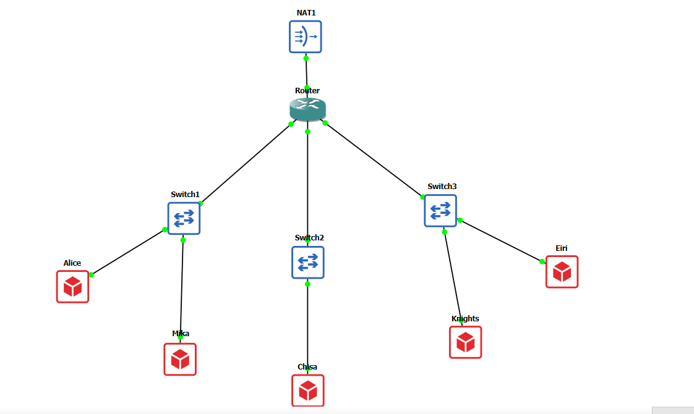

Pada gambar topologi tersebut, ada 5 client dimana client 1 (Alice) dan client 2 (Mika) berada pada satu switch (Switch 1), lalu client 3 (Chisa) dengan switch sendiri (Switch 2), dan yang terakhir client 4 (Knights) dan client 5 (Eiri) pada satu switch (Switch 3) dimana ketiga switch ini berada pada satu router Lain.

2. Karena menurut Lain pada saat itu The Wired masih terisolasi dari
dunia luar, konfigurasikan router Lain agar dapat tersambung langsung
ke jaringan internet publik melalui NAT/DHCP pada interface eth0.

Pada soal ke 2 ini, yang harus kita lakukan adalah melakukan IP Config pada router Lain sehingga bisa tersampung langsung ke jaringan internet publik. Dengan mengedit network configuration menjadi code berikut

Untuk router:
```sh
auto eth0
iface eth0 inet dhcp
    up sysctl -w net.ipv4.ip_forward=1
    up iptables -t nat -A POSTROUTING -o eth0 -j MASQUERADE
    up /root/cek_status.sh
auto eth1
iface eth1 inet static
    address 10.79.1.1
    netmask 255.255.255.0

auto eth2
iface eth2 inet static
    address 10.79.2.1
    netmask 255.255.255.0

auto eth3
iface eth3 inet static
    address 10.79.3.1
    netmask 255.255.255.0
```

Interface eth0 dikonfigurasi menggunakan DHCP agar Router dapat memperoleh IP Address secara otomatis dari jaringan publik. Selanjutnya, ip_forward diaktifkan agar Router dapat meneruskan paket data antar-interface, sedangkan konfigurasi MASQUERADE digunakan untuk melakukan NAT sehingga perangkat pada jaringan internal dapat mengakses internet melalui IP milik Router.

Sementara itu, eth1, eth2, dan eth3 dikonfigurasi menggunakan IP statis yang masing-masing menjadi gateway untuk jaringan pada Switch 1, Switch 2, dan Switch 3.

Berikut adalah bukti bahwa router Lain telah berhasil terhubung dengan jaringan internet publik dibuktikan dengan pengujian ping ke IP 8.8.8.8 dan domain google.com


3. Setelah router Lain terhubung ke internet, pastikan seluruh Entitas
(Client) di bawah Switch 1, Switch 2, dan Switch 3 dapat saling
terhubung dan berkomunikasi satu sama lain melalui konfigurasi
routing.

Agar bisa berkomunikasi dengan satu sama lain, maka client masing-masing perlu di edit network configurationnya seperti dibawah ini

Untuk Client 1 (Alice):
```sh
auto eth0
iface eth0 inet static
    address 10.79.1.2
    netmask 255.255.255.0
    gateway 10.79.1.1
```

Untuk Client 2 (Mika): 
```sh
auto eth0
iface eth0 inet static
    address 10.79.1.3     
    netmask 255.255.255.0
    gateway 10.79.1.1
```

Untuk Client 3 (Chisa):
```sh
auto eth0
iface eth0 inet static
    address 10.79.2.2
    netmask 255.255.255.0
    gateway 10.79.2.1
```
Untuk Client 4 (Knights):
```sh
auto eth0
iface eth0 inet static
    address 10.79.3.2
    netmask 255.255.255.0
    gateway 10.79.3.1
```

Untuk Client 5 (Eiri):
```sh
auto eth0
iface eth0 inet static
    address 10.79.3.3
    netmask 255.255.255.0
    gateway 10.79.3.1
```

Konfigurasi ini bertujuan untuk memberikan IP Address dan gateway pada masing-masing Client sesuai dengan subnetnya. Gateway pada setiap Client diarahkan ke interface Router Lain yang terhubung dengan subnet tersebut. Dengan demikian, Router Lain dapat menjadi penghubung antar-subnet sehingga kelima Client dapat saling berkomunikasi.
Berikut adalah beberapa bukti bahwa client dapat saling berkomunikasi melalui pengujian ping IP address nya:


4. Lain ingin agar setiap Entitas (Client) memiliki kemandirian di The
Wired. Konfigurasikan firewall/iptables (NAT Masquerade) dan DNS
resolver agar setiap Client dapat terhubung ke internet secara mandiri
(dapat melakukan ping ke 8.8.8.8 dan membuka domain web
google.com).

Mengonfigurasi iptables/firewall dengan menambahkan ini di config dan DNS Resolver agar setiap client dapat terhubung ke internet dengan script berikut di konsol: (dilakukan di setiap clientnya)
```sh
echo "nameserver 8.8.8.8" > /etc/resolv.conf
```
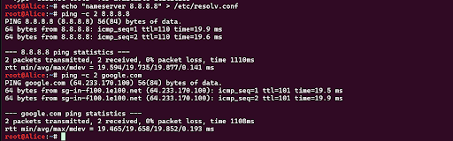


5. Eiri berupaya menanamkan kekacauan dalam jaringan. Untuk mengantisipasi restart, pastikan seluruh konfigurasi tidak hilang saat semua node di-restart. Kemudian buat script verifikasi di cek_status.sh pada Lain yang menampilkan ringkasan interface (ip -br a) dan status tabel NAT (iptables -t -L -v -n) setelah reboot.
   
Agar seluruh konfigurasi tidak hilang saat semua node di-restart maka kita perlu meletakkan konfigurasinya di file `/etc/network/interfaces`. File ini dibaca ulang secara otomatis oleh sistem setiap kali interface diaktifkan (ifup) atau saat node melakukan boot, sehingga konfigurasi tetap konsisten meskipun node di-restart.

Berikut isi konfigurasi yang diletakkan di `/etc/network/interfaces` dari setiap node.

- Lain
  ```sh
    cat > /etc/network/interfaces << 'EOF'
    auto eth0
    iface eth0 inet dhcp
        up sysctl -w net.ipv4.ip_forward=1
        up iptables -t nat -A POSTROUTING -o eth0 -j MASQUERADE

    auto eth1
    iface eth1 inet static
        address 10.79.1.1
        netmask 255.255.255.0

    auto eth2
    iface eth2 inet static
        address 10.79.2.1
        netmask 255.255.255.0

    auto eth3
    iface eth3 inet static
        address 10.79.3.1
        netmask 255.255.255.0
    EOF

    ifdown eth0 2>/dev/null; ifup eth0
    ifdown eth1 2>/dev/null; ifup eth1
    ifdown eth2 2>/dev/null; ifup eth2
    ifdown eth3 2>/dev/null; ifup eth3
  ```

- Alice
  ```sh
    cat > /etc/network/interfaces << 'EOF'
    auto eth0
    iface eth0 inet static
        address 10.79.1.2
        netmask 255.255.255.0
        gateway 10.79.1.1
    EOF

    ifdown eth0 2>/dev/null; ifup eth0
  ```

- Mika 
  ```sh
    cat > /etc/network/interfaces << 'EOF'
    auto eth0
    iface eth0 inet static
        address 10.79.1.3     
        netmask 255.255.255.0
        gateway 10.79.1.1
    EOF

    ifdown eth0 2>/dev/null; ifup eth0
  ```

- Chisa
  ```sh
    cat > /etc/network/interfaces << 'EOF'
    auto eth0
    iface eth0 inet static
        address 10.79.2.2
        netmask 255.255.255.0
        gateway 10.79.2.1
    EOF

    ifdown eth0 2>/dev/null; ifup eth0
  ```

- Knights
  ```sh
    cat > /etc/network/interfaces << 'EOF'
    auto eth0
    iface eth0 inet static
        address 10.79.3.2
        netmask 255.255.255.0
        gateway 10.79.3.1
    EOF

    ifdown eth0 2>/dev/null; ifup eth0
  ```

- Eiri 
  ```sh   
    cat > /etc/network/interfaces << 'EOF'
    auto eth0
    iface eth0 inet static
        address 10.79.3.3
        netmask 255.255.255.0
        gateway 10.79.3.1
    EOF

    ifdown eth0 2>/dev/null; ifup eth0
  ```

Setelah konfigurasi interface dipastikan konsisten, langkah selanjutnya adalah memverifikasi bahwa konfigurasi tersebut benar-benar diterapkan setelah node melakukan reboot. Untuk itu, dibuat script verifikasi `cek_status.sh` pada node Lain yang akan menampilkan ringkasan interface serta status tabel NAT setiap kali dijalankan.

Berikut isi script `cek_status.sh`
```sh
echo "Ringkasan Interface"
ip -br a
echo " "
echo "Status Table NAT"
iptables -t nat -L -v -n
```

Setelah reboot dan menjalankan script `cek_status.sh` akan muncul output seperti berikut ini.

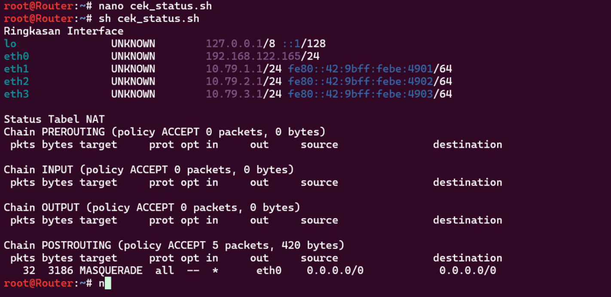

output tersebut memverifikasi bahwa konfigurasi tetap berjalan setelah dilakukan reboot.

6. Mika mencurigai adanya anomali traffic pada segmen jaringannya. Jalankkan generator traffic dari link berikut pada node Mika, kemudian lakukan packet sniffing dengan Wireshark pada interface node Mika. 

pertama-tama kita perlu mengunduh file dari link google drive yang telah diberikan menggunakan command `wget`

```sh
wget --no-check-certificate "https://drive.usercontent.google.com/download?id=1G9zIi20ofbOgfffor-i-e7QKU3Ihe42W&export=download&confirm=t" -O traffic_protocol7.zip
```

Kemudian setelah terunduh, file tersebut diunzip dengan command `unzip`. karena command unzip belum terinstall, kita perlu menginstall unzip terlebih dahulu. 

```sh
apt install unzip -y
unzip -o traffic_protocol7.zip
```

Setelah file traffic generator berhasil diekstrak, packet sniffing dilakukan menggunakan Wireshark yang dibuka melalui fitur capture pada GNS3 Client, pada link antara node Mika dan Switch1.

Capture di Wireshark dimulai terlebih dahulu, baru kemudian `script traffic_protocol7.sh` dijalankan di terminal node Mika. Berikut output setelah script dijalankan:

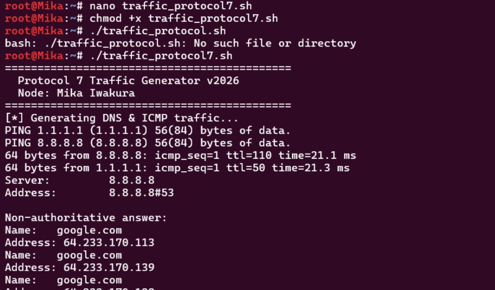

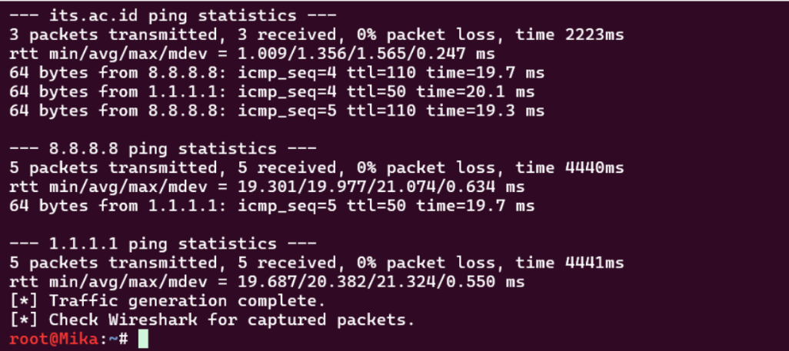

Traffic yang tertangkap kemudian difilter dengan `dns || icmp`, karena paket yang diminta hanya yang berprotokol DNS atau ICMP.

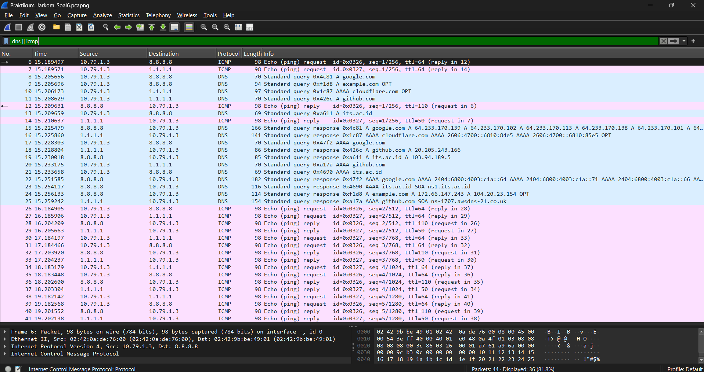

Dari hasil capture tersebut terdapat 36 paket yang ditampilkan setelah filter diterapkan, yang terdiri dari traffic ICMP ke `8.8.8.8` dan `1.1.1.1`, serta traffic DNS query/response untuk beberapa domain seperti `google.com`, `github.com`, dan `cloudflare.com`.

File pcapng untuk nomer ini bisa diakses melalui: [soal 6.pcapng](artefacts/soal-6-wireshark.pcapng)

7. Chisa mendirikan FTP server pada node miliknya dengan shared folder di /var/wired/data.  Terapkan kebijakan akses: user alice (hak akses read & write), user mika (dibatasi read-only), dan user eiri (dibatasi tanpa izin akses / blacklist).
   
Pertama-tama kita perlu menginstall ftp dulu agar bisa mendirikan FTP server. Berikut command untuk menginstall ftp.

```sh
apt update
apt install vsftpd -y
apt install ftp -y
```

Setelah itu kita perlu membuat direktori yang nantinya akan digunakan sebagai root direktori ftp.

```sh
mkdir -p /var/wired/data
```

Selanjutnya adalah membuat tiga user, yakni alice, mika, dan eiri yang masing-masing memiliki hak akses yang berbeda terhadap ftp server.

```sh
useradd -m -s /bin/bash Alice
echo "Alice:alice123" | chpasswd

useradd -m -s /bin/bash Mika
echo "Mika:mika123" | chpasswd

useradd -m -s /bin/bash Eiri
echo "Eiri:eiri123" | chpasswd
```

Setelah user dibuat, selanjutnya adalah mengonfigurasi akses dari setiap usernya. 

Dimulai dari Alice, karena alice aksesnya adalah Write & Read, maka kepemilikan direktori diarahkan ke Alice dengan permission 755.

```sh
chown -R Alice:Alice /var/wired/data
chmod 755 /var/wired/data
```

kemudian sebelum mengatur akses kedua  user lainnya, kita perlu membuat konfigurasi utama vsftpd di `/etc/vsftpd.conf`. 

```sh
cat > /etc/vsftpd.conf << 'EOF'
listen=YES
listen_ipv6=NO
listen_address=10.79.2.2

anonymous_enable=NO
local_enable=YES
write_enable=YES

local_umask=022
local_root=/var/wired/data

userlist_enable=YES
userlist_file=/etc/vsftpd.userlist
userlist_deny=YES

user_config_dir=/etc/vsftpd_user_conf

pasv_enable=YES
pasv_min_port=10000
pasv_max_port=10100
EOF
```

Konfigurasi ini mengatur agar server hanya listen pada IP `10.79.2.2`, menonaktifkan akses anonymous, mengaktifkan local user login, serta mengarahkan root direktori FTP ke `/var/wired/data`. Selain itu ditambahkan userlist untuk membatasi user mana saja yang boleh mengakses FTP, dan konfigurasi passive mode untuk mendukung koneksi FTP pasif.

Karena `userlist_deny=YES` maka user yang terdaftar di `/etc/vsftpd.userlist` akan terblokir aksesnya. Oleh karena itu nama Eiri didaftarkan ke userlist tersebut agar tidak bisa melakukan login ke FTP server.

```sh
echo "Eiri" > /etc/vsftpd.userlist
```

Untuk mengatur hak akses tiap user secara lebih spesifik, dibuat konfigurasi tambahan pada direktori `/etc/vsftpd_user_conf`. Mika diberikan akses read-only (`write_enable=NO`), sedangkan Alice diberikan akses read & write pada direktori FTP.

```sh
mkdir -p /etc/vsftpd_user_conf

cat > /etc/vsftpd_user_conf/Mika << 'EOF'
write_enable=NO
EOF

cat > /etc/vsftpd_user_conf/Alice << 'EOF'
write_enable=YES
EOF
```

setelah semua hak akses user dikonfigurasi, service vsftpd di-restart agar seluruh konfigurasi yang telah dibuat diterapkan.

```sh
service vsftpd restart
```

saat vsftpd telah dimulai, langkah selanjutnya adalah mencoba menguji apakah hak akses tiap user sudah sesuai dengan yang dikonfigurasi. sebelum melakukan pengujian diperlukan untuk membuat file `signal_alice.txt` yang nantinya akan diupload setelah login ke ftp server.

setelah itu pengujian dilakukan dengan masuk ke ftp server menggunakan command berikut ini.

```sh
ftp 10.79.2.2
```

login pertama dilakukan menggunakan user Alice, kemudian membuat file `signal_alice.txt` untuk memastikan Alice memang memiliki akses read & write ke direktori FTP. berikut command yang digunakan.

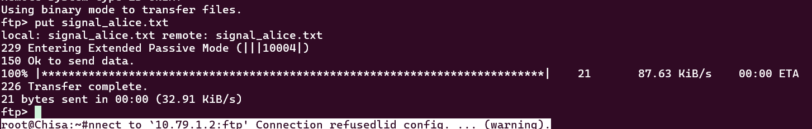

dari gambar tersebut terbukti bahwa Alice dapat mengupload file ke FTP Server, sesuai dengan konfigurasi yang sudah diterapkan yakni `write_enable=YES`.

selanjutnya mencoba login ke FTP Server menggunakan user Eiri untuk memastikan bahwa Eiri benar-benar ditolak aksesnya, sesuai dengan konfigurasi `userlist_deny=YES` yang telah diterapkan sebelumnya.

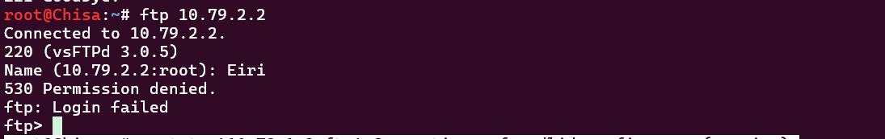

dari gambar tersebut terbukti bahwa Eiri tidak dapat melakukan login. setelah memasukkan password, muncul pesan `530 permission denied`, yang menandakan bahwa akses login Eiri ditolak sesuai dengan konfigurasi yang telah diterapkan. 

8. Kelompok rahasia Knights perlu mengirimkan dokumen laporan intelijen ke FTP Server Chisa. Lakukan koneksi FTP client dari node Knights ke FTP Server Chisa menggunakan akun alice.

pertama-tama kita perlu menginstall `wget` karena command belum tersedia.

```sh
apt update
apt install wget -y
```

setelah `wget` terinstall, selanjutnya file dari link google drive yang telah diberikan diunduh dengan command `wget`.

```sh
wget --no-check-certificate "https://drive.usercontent.google.com/download?id=1lFepK4wFmx55PnRki3NsHW-ivudSR0vg&export=download&confirm=t" -O knights_report.zip
```

Kemudian setelah file berhasil terunduh, file tersebut diunzip dengan command `unzip`

```sh
unzip knights_report.zip
```

setelah file berhasil terekstrak, selanjutnya melalui node Knights kita melakukan koneksi FTP client ke FTP server chisa menggunakan akun Alice.

```sh
ftp 10.79.2.2
```


sebelum melakukan upload, packet capture pada Wireshark diaktifkan terlebih dahulu melalui fitur capture di GNS3 Client, pada link yang menghubungkan node Knights dengan segmen jaringan menuju FTP Server Chisa. 

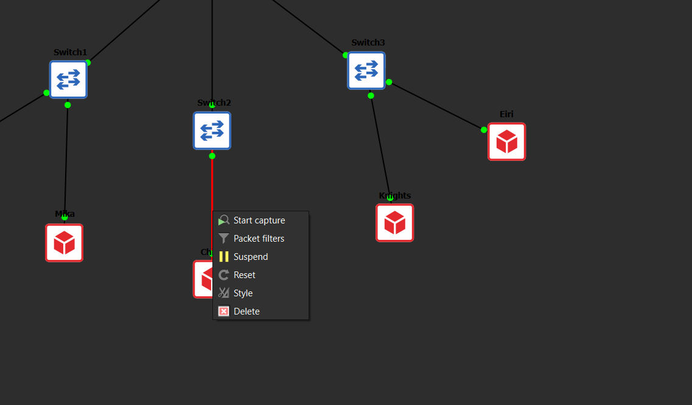

setelah capture berjalan, Knights selanjutnya mengupload dokumen laporan intelijen ke FTP Server Chisa melalui akun Alice.

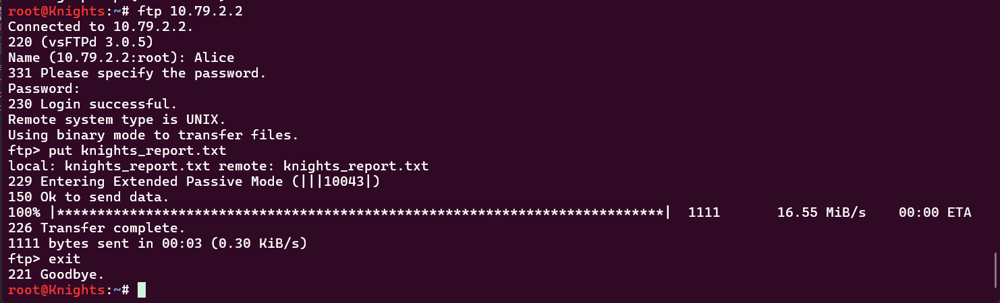

setelah proses upload selesai, hasil capture dari wireshark kemudian dianalisis untuk mengidentifikasi proses komunikasi FTP yang terjadi dari hasil analisis yang dilakukan, ditemukan beberapa hal berikut. 

- perintah FTP untuk upload (STOR)

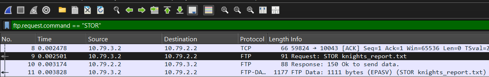

pada packet nomor 9, ditemukan perintah `STOR knights_report.txt` yang dikirim oleh client (Knights, 10.79.3.2) ke server (Chisa, 10.79.2.2), menandakan bahwa client meminta untuk mengunggah file `knights_report.txt` ke server.

- kode status sukses (226) 

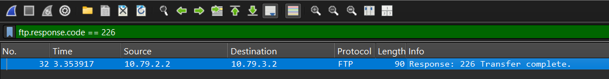

pada packet nomor 32, server merespons dengan kode status `226 Transfer complete`, yang menandakan bahwa proses upload file berhasil dilakukan.

- port data yang dinegosiasikan pada mode PASV

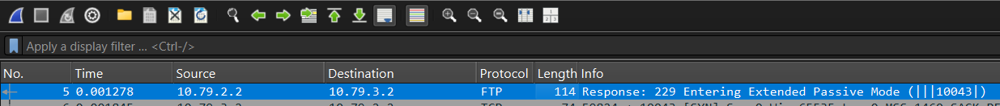

pada paket nomor 5, server merespons request `EPSV` dari client dengan `229 Entering Extended Passive Mode (|||10043|)`, yang menunjukkan bahwa port data yang dinegosiasikan untuk transfer file adalah port 10043. port ini yang kemudian digunakan pada proses TCP handshake (SYN, SYN-ACK, ACK) sebelum data file dikirim melalui protokol FTP-DATA.

file pcapng untuk soal ini dapat diakses melalui link berikut ini: [pcapng soal 8](artefacts/soal-8-wireshark.pcapng)

9. Mika mengakses dokumen Protokol Tujuh di (link file) dari FTP Server Chisa. Dari node Mika, unduh file tersebut menggunakan akun mika. Setelah itu, buktikan pembatasan read-only dengan mencoba mengunggah file baru dari akun mika. 

pertama-tama kita perlu menginstall `wget` pada node Mika apabila command tersebut belum tersedia. 

```sh
apt update
apt install wget -y
```

setelah `wget` terunduh, file dari link google drive yang telah diberikan diunduh dengan command `wget`.

```sh
wget --no-check-certificate "https://drive.usercontent.google.com/download?id=1tKZu0rcti4t-fXX4jtXDSKDBWzsawfoN&export=download&confirm=t" -O protocol7_manifesto.zip
```

Kemudian setelah terunduh, file tersebut diunzip dengan command `unzip`

```sh
unzip -l protocol7_manifesto.zip
``` 

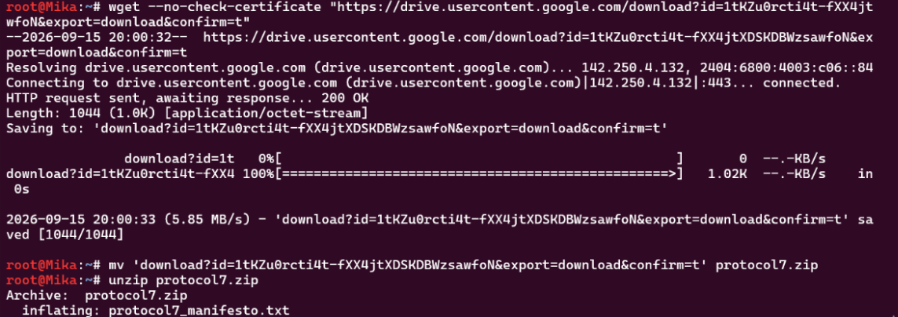

Setelah file berhasil terekstrak, langkah selanjutnya adalah mencoba login ke FTP server milik Chisa melalui node Mika. Berikut command yang digunakan.

```sh
ftp 10.79.2.2
```

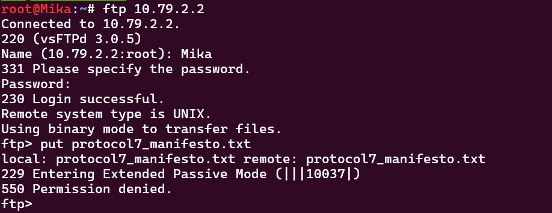

Setelah berhasil login ke akun mika, selanjutnya adalah mencoba mengupload file yang sudah diunduh. Hasil yang keluar setelah percobaan tersebut adalah `550 permission denied` atau gagal. penolakan tersebut membuktikan bahwa benar akses pada akun mika hanya `read-only`. 

10. Knights melancarkan uji ketahanan koneksi ke server Chisa untuk menguji latensi jaringan The Wired. Kirimkan paket ping dari node Knights ke node Chisa dengan payload khusus 128 bytes dan interval 0.3 detik sebanyak 77 paket (ping -c 77 -s 128 -i 0.3 <IP Chisa>)

pada soal ini Knights melancarkan uji ketahanan koneksi ke server Chisa untuk menguji latensi jaringan The Wired. pengujian dilakukan dengan mengirimkan paket ping dari node Knights ke node Chisa, menggunakan payload khusus sebesar 128 bytes, interval pengiriman 0.3 detik, sebanyak 77 paket. 

sebelum melakukan pengujian, packet capture pada Wireshark diaktifkan terlebih dahulu melalui fitur capture di GNS3 Client, pada link yang menghubungkan node Knights dengan node Chisa.

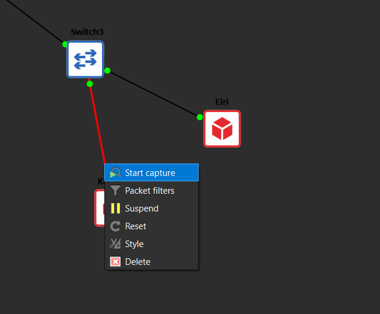

setelah capture berjalan, command ping dijalankan melalui node knights. berikut command yang digunakan.

```sh
ping -c 77 -s 128 -i 0.3 10.79.2.2
```

berikut hasil output setelah command dijalankan.

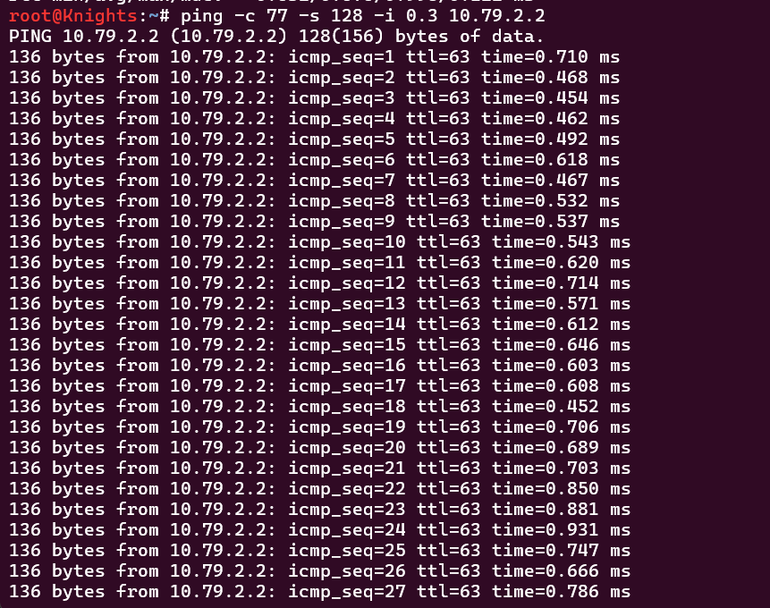

traffic ICMP yang tertangkap kemudian difilter menggunakan `icmp` pada Wireshark untuk memisahkan traffic Echo Request dan Echo Reply dari traffic lainnya.

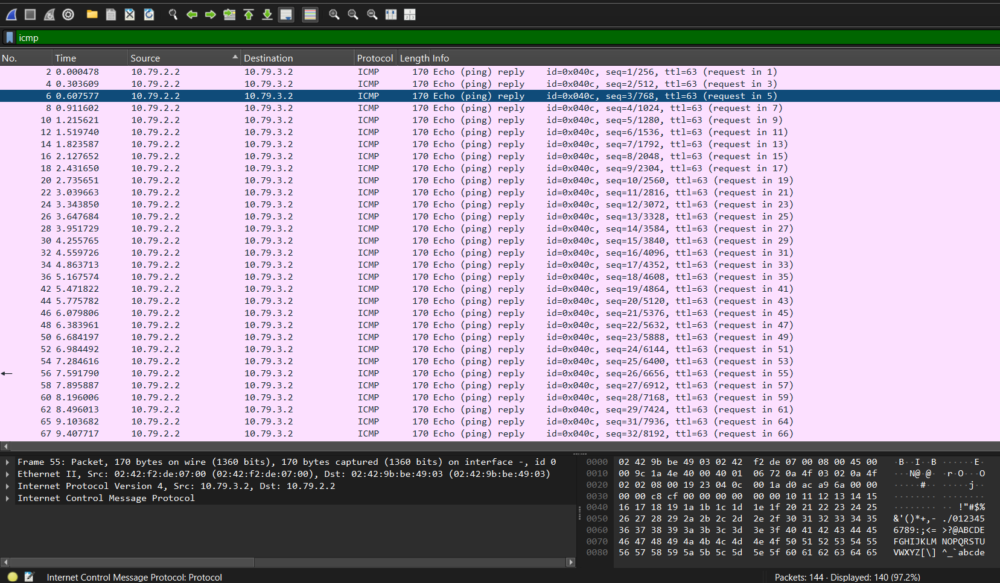

Berdasarkan hasil filter tersebut, dilakukan pengecekan pada salah satu paket Echo Request dan Echo Reply untuk melihat nilai ICMP Type dan Code masing-masing.

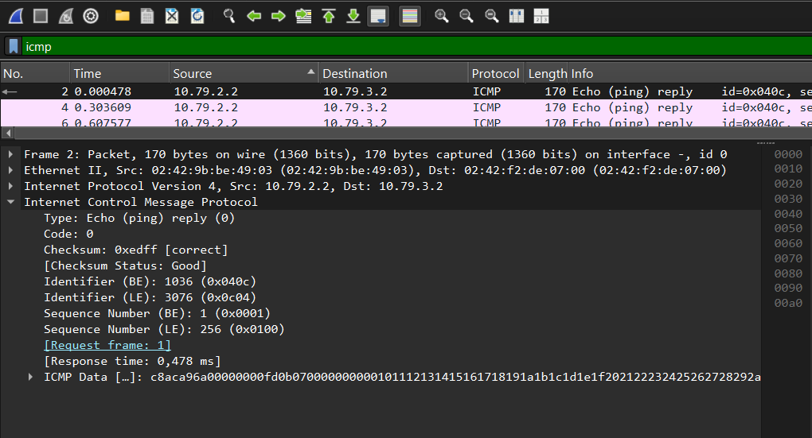

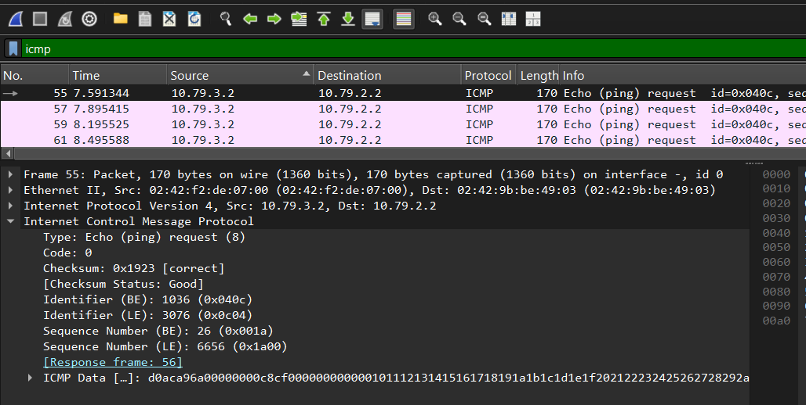

Dari sisi protokol ICMP, paket Echo Request yang dikirim oleh Knights memiliki Type 8, Code 0, sedangkan paket Echo Reply yang dikembalikan oleh Chisa memiliki Type 0, Code 0. kedua nilai ini menunjukkan bahwa proses request-reply ICMP berjalan sesuai standar protokol ICMP.

Selanjutnya dilakukan analisis packet loss dan RTT (Round Trip Time) dari keseluruhan traffic ICMP yang tertangkap. Berdasarkan hasil capture, dari 77 paket Echo Request yang dikirim, hanya 63 paket Echo Reply yang diterima kembali, sehingga terdapat 14 packet loss (18.18%). Hasil statistik RTT yang diperoleh adalah sebagai berikut:

| Statistik | Nilai |
|-----------|-------|
| RTT Min   | 0.283 ms |
| RTT Max   | 1.171 ms |
| RTT Avg   | 0.435 ms |

Adanya packet loss ini mengindikasikan bahwa terjadi gangguan pada koneksi antara node Knights dan Chisa selama pengujian berlangsung. 

file pcap dapat diakses melalui link berikut ini: [pcapng soal 10](artefacts/soal-10-wireshark.pcapng)

11. Buktikan kelemahan protokol Telnet dengan membuat akun phantom_user dan password wired_ghost pada layanan telnetd di node Chisa. Lakukan login Telnet dari node Eiri ke node Chisa dan tangkap sesi menggunakan Wireshark.

pertama-tama kita perlu menginstall layanan telnetd pada node chisa. untuk instalasinya menggunakan command berikut ini.

```sh
apt update
apt install telnetd openbsd-inetd -y
```

selanjutnya membuat user `phantom_user` dengan password `wired_ghost` yang nantinya akan digunakan untuk login telnet melalui node Eiri. 

```sh
if ! id phantom_user >/dev/null 2>&1; then
    useradd -m -s /bin/bash phantom_user
fi

echo "phantom_user:wired_ghost" | chpasswd
```

setelah user dan password dikonfigurasi, service `openbsd-inetd` yang menjalankan `telnetd` di-restart agar konfigurasi diterapkan.

```sh
service openbsd-inetd restart
```

untuk memastikan konfigurasi berhasil, dilakukan verifikasi dengan mengecek keberadaan user `phantom_user` serta memastikan service Telnet sudah listening pada port 23.

```sh
id phantom_user
ss -lntp | grep ':23'
```

setelah layanan telnet pada node chisa siap, langkah selanjutnya adalah mengaktifkan fitur packet capture pada wireshark melalui link pada node Eiri karena kita perlu mengcapture proses login telnet chisa melalui node eiri. 

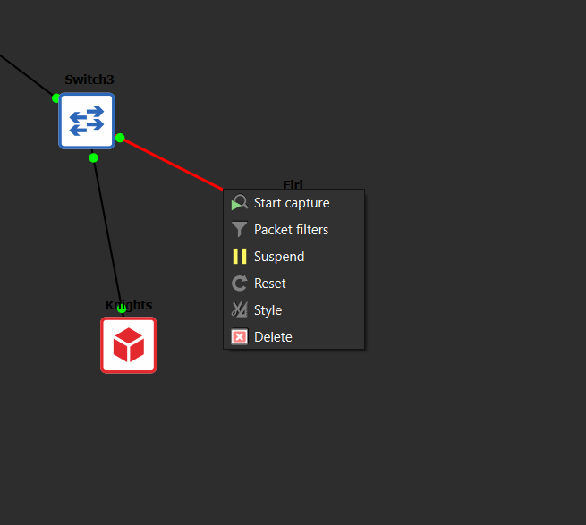

setelah capture dimulai, selanjutnya adalah melakukan login telnet Chisa melalui node Eiri. koneksi ke telnet chisa dilakukan menggunakan command berikut ini.

```sh
telnet 10.79.2.2
```

berikut adalah output setelah menjalankan command tersebut. 

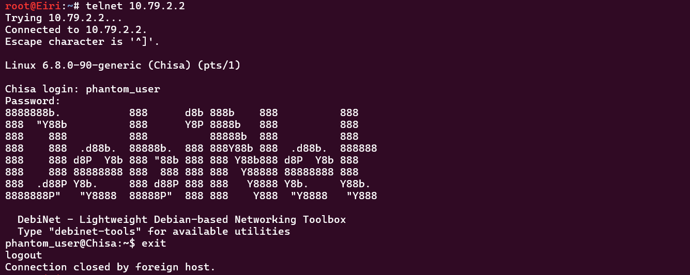

setelah koneksi berhasil terhubung, sistem akan menampilkan output `chisa login:`, kemudian kita memasukkan username yang sudah kita buat yaitu `phantom_user` beserta passwordnya `wired_ghost`. setelah proses autentikasi berhasil, muncul banner login dari sistem Chisa yang memverifikasi bahwa Eiri berhasil melakukan login telnet Chisa menggunakan akun `phantom_user`. 

setelah proses login telnet berhasil, langkah selanjutnya adalah menganalisis traffic yang tertangkap pada Wireshark. 

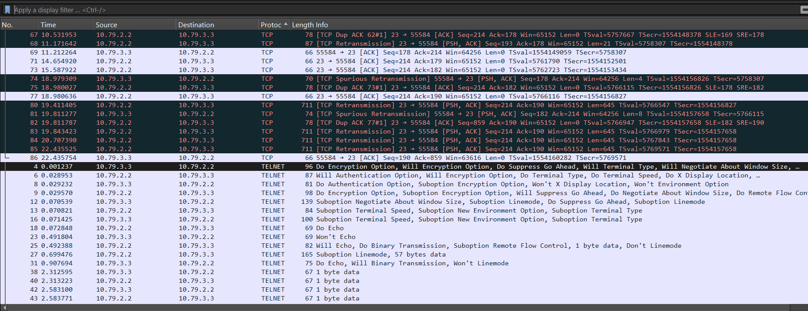

analisis dilakukan pada salah satu paket telnet, kemudian kita melakukan follow tcp stream. berikut hasil follow tcp stream pada salah satu paket.

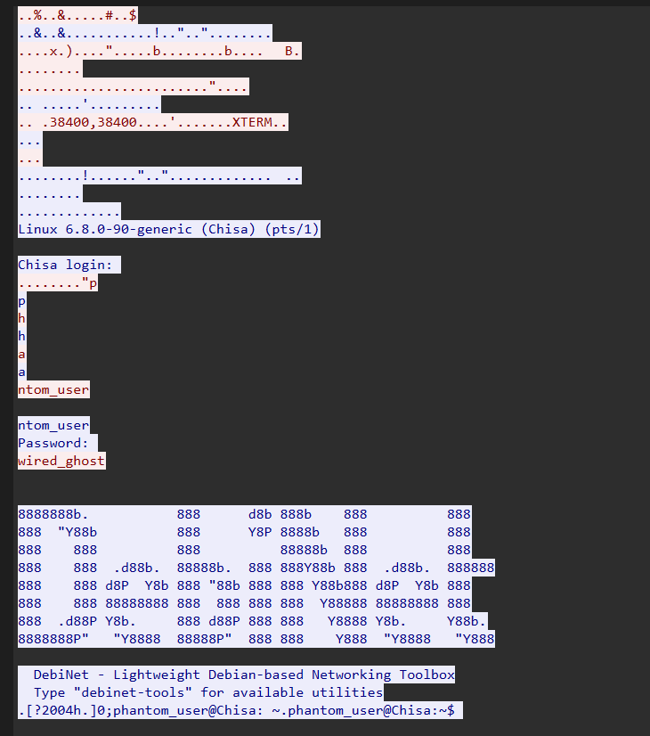

dari hasil Follow TCP Stream tersebut, terlihat bahwa username `phantom_user` dan password `wired_ghost` yang diketikkan oleh Eiri saat login dapat terbaca secara jelas dalam bentuk plain text, tanpa adanya enkripsi sama sekali. 

Selain itu, apabila diperhatikan pada daftar paket TCP di Wireshark, terlihat bahwa setiap karakter yang diketikkan dikirim dalam paket TCP yang terpisah, bukan dikirim sekaligus dalam satu paket per baris (username atau password). 

Hal ini terjadi karena Telnet secara default beroperasi dalam mode character-at-a-time, di mana setiap kali user menekan satu tombol karakter, karakter tersebut langsung dikirim oleh client ke server saat itu juga, tanpa menunggu seluruh input selesai diketik. 

Server kemudian akan mengirimkan balasan berupa echo dari karakter tersebut agar tampil di layar client. Mekanisme inilah yang menyebabkan traffic Telnet, khususnya untuk input seperti username dan password, terlihat terpecah menjadi banyak paket kecil berukuran 1 karakter di Wireshark.

file pcap untuk soal ini dapat diakses melalui link berikut: [pcapng soal 11](artefacts/soal-11-wireshark.pcapng)

12. asha

13. Lain memerintahkan agar administrasi jarak jauh menggunakan SSH secara aman tanpa password. Install OpenSSH server pada node Knights, buat pasangan kunci SSH (ssh-keygen) pada node Mika untuk user mika_admin, dan konfigurasikan public key authentication (PasswordAuthentication no). 

Pertama-tama, kita melakukan instalasi paket `openssh-server` pada node Knights agar dapat berfungsi sebagai SSH server.

```sh
apt update
apt install openssh-server -y
```

selanjutnya membuat user `mika_admin` yang akan digunakan sebagai akun untuk login SSH dari node Mika.

```sh
useradd -m -s /bin/bash mika_admin
echo "mika_admin:mikaadmin" | chpasswd
```

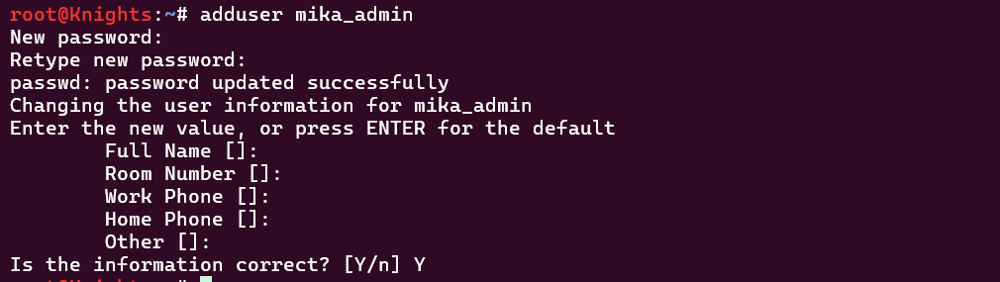

Setelah user dibuat, service `ssh` di-restart agar konfigurasi diterapkan.

```sh
service ssh restart
```

kemudian pada node mika dilakukan instalasi paket `openssh-client` agar dapat digunakan untuk melakukan koneksi SSH ke node Knights. berikut command yang digunakan.

```sh
apt update
apt install openssh-client -y
```

setelah `openssh-client` berhasil terinstall, selanjutnya adalah membuat pasangan kunci SSH pada node mika menggunakan ssh-keygen. berikut command yang digunakan.

```sh
ssh-keygen -t rsa -b 4096
```

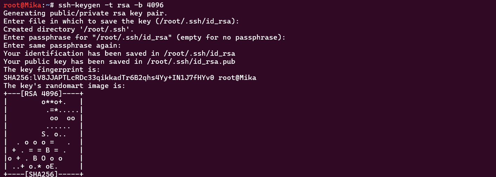

pada proses pembuatan pasangan kunci ssh, Passphrase dikosongkan (`-N ""`) agar proses autentikasi nantinya benar-benar tanpa password.


untuk memastikan pasangan kunci berhasil dibuat, dilakukan pengecekan pada direktori `~/.ssh/` dengan command berikut ini. 

```sh
ls -la ~/.ssh/
```

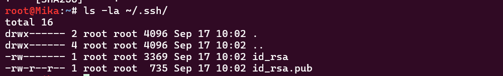

setelah pasangan kunci SSH berhasil dibuat, langkah selanjutnya adalah menyalin public key milik Mika ke node Knights, agar public key tersebut terdaftar sebagai kunci yang diizinkan untuk login ke akun `mika_admin`. proses ini dilakukan menggunakan command `ssh-copy-id`.

```sh
ssh-copy-id mika_admin@10.79.3.2
```

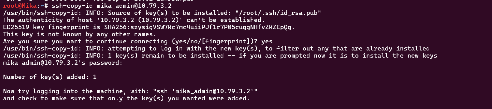

setelah berhasil menyalin public key milik Mika ke node Knights, selanjutnya kita perlu mengaktifkan fitur capture wireshark di GNS3-Webclient, proses capture ini dilakukan melalui link pada node Mika. 

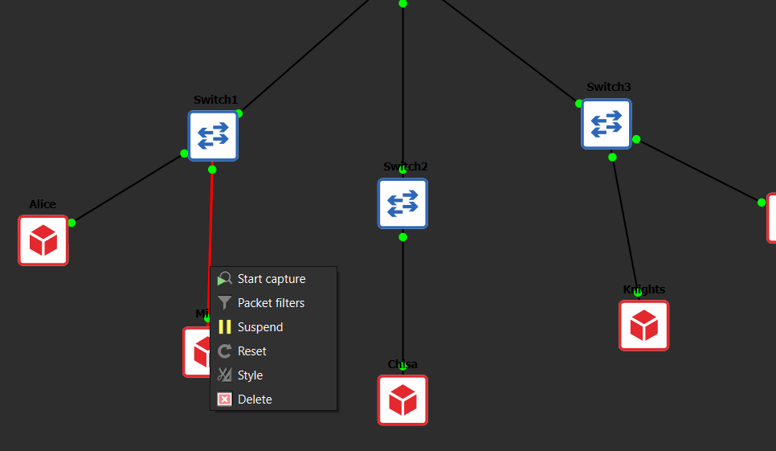

selanjutnya, dari node Mika kita melakukan koneksi SSH ke node Knights. Berikut command yang digunakan.

```sh
ssh mika_admin@10.79.3.2
```

Berikut adalah output setelah menjalankan command tersebut.

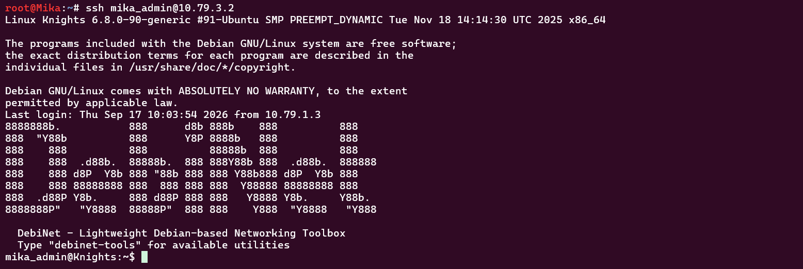

Dari hasil pengujian tersebut, terbukti bahwa Mika berhasil login ke node Knights melalui SSH tanpa perlu memasukkan password, karena autentikasi dilakukan menggunakan public key yang telah dikonfigurasi sebelumnya.

Setelah proses koneksi selesai, hasil capture pada Wireshark kemudian dianalisis untuk mengidentifikasi tahapan awal dari komunikasi SSH, yaitu Protocol Version Exchange dan Key Exchange.

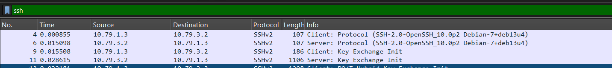

Dari daftar packet yang tertangkap, terlihat komunikasi SSH diawali dua tahap yang masih plain text:

- Protocol Version Exchange (packet 4 dan 6) 
client (Mika) dan server (Knights) saling bertukar versi protokol (`SSH-2.0-OpenSSH_10.0p2 Debian-7+deb13u4`), buat mastiin kompatibilitas versi sebelum lanjut, belum ada data sensitif.


- Key Exchange (packet 9-13) 
client dan server negosiasi algoritma (`Key Exchange Init`), lalu menukar kunci (`PQ/T Hybrid Key Exchange Init` dan `Reply`) untuk membuat session key, tanpa perlu mengirim password langsung lewat jaringan.

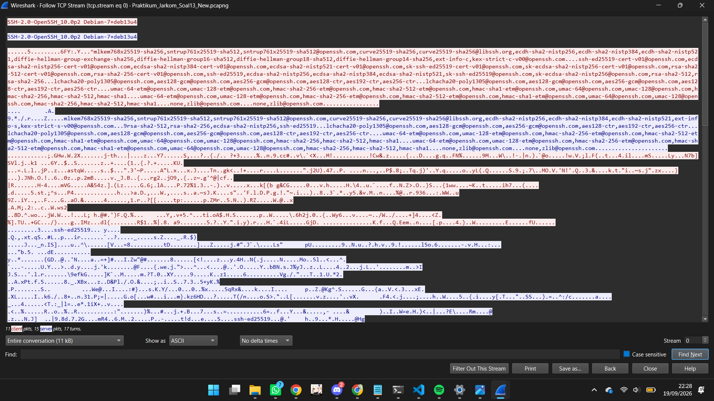

Begitu Key Exchange selesai, semua komunikasi setelahnya menjadi `Encrypted packet` (dapat dilihat dari packet 14 dst). Hal ini berarti, proses autentikasi (baik public key maupun password) terjadi setelah session key terbentuk, jadi sudah terenkripsi duluan sebelum dikirim.

Berbeda dengan Telnet yang tidak memiliki Key Exchange atau enkripsi sama sekali, semua data termasuk username dan password, dikirim tanpa dienkripsi dari awal sampai akhir sesi. Maka dari  itu kredensial di SSH tidak terbaca meski traffic-nya disadap, sementara di Telnet langsung terbaca melalui Follow TCP Stream.

file pcapng untuk nomor ini dapat diakses melalui link berikut ini: [pcapng soal 13](artefacts/soal-13-wireshark.pcapng)

14.  Setelah gagal mengakses FTP, Eiri melancarkan serangan brute-force terhadap form login web Alice. Analisis file capture wired_bruteforce.pcappng untuk megidentifikasi alamat IP penyerang, target IP beserta port yang diserang, password user lain_admin yang berhasil ditembus, serta web server software dan versi yang dilaporkan pada response header. Validasi temuan kalian pada socket server: (link file) nc [IP_Group] 3401

- Alamat IP penyerang: 172.26.7.50 
- Alamat IP target beserta portnya: 172.26.7.100:8080

Dapat dilihat pada gambar berikut di bagian IP source, IP destination beserta info (SYN,ACK,FIN,port)
.png)

- Password user_lain: wired_pr0tocol_7

Dapat dilihat pada gambar berikut, saat mengfilter http.request dan menemukan informasi password di bagian bawah (HTML Form URL)


